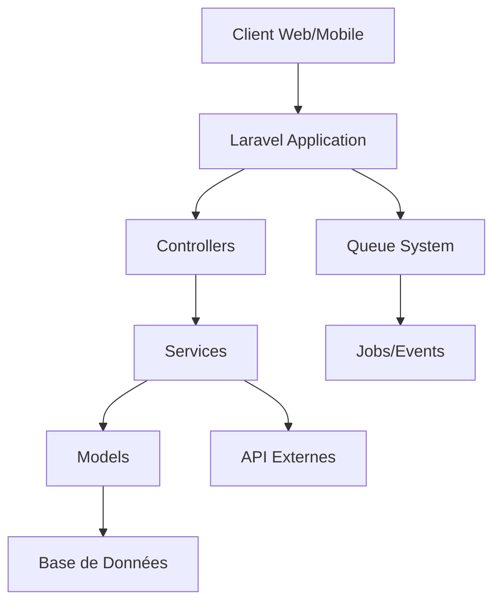
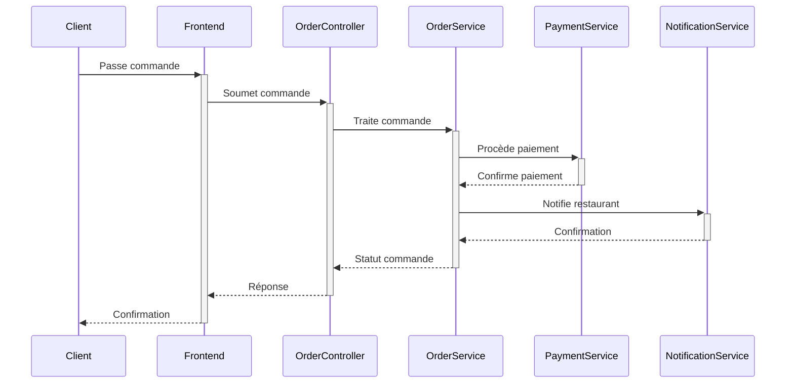

# Architecture du Projet

## Vue d'Ensemble



## Structure des Couches

### 1. Couche Présentation

```
resources/
├── views/
│   ├── layouts/         # Templates de base
│   ├── components/      # Composants Blade réutilisables
│   ├── admin/          # Vues administration
│   ├── restaurant/     # Vues gestion restaurant
│   └── client/         # Vues client
├── js/
└── css/
```

### 2. Couche Application

```
app/
├── Http/
│   ├── Controllers/
│   │   ├── Admin/          # Logique administration
│   │   ├── Restaurant/     # Logique restaurant
│   │   └── Client/         # Logique client
│   ├── Middleware/         # Filtres de requêtes
│   └── Requests/          # Validation des formulaires
├── Services/
│   ├── Payment/           # Service de paiement
│   ├── Order/            # Service de commande
│   └── Notification/     # Service de notification
└── Events/               # Événements système
```

### 3. Couche Domaine

```
app/
├── Models/
│   ├── User.php
│   ├── Restaurant.php
│   ├── Menu.php
│   ├── Order.php
│   └── Product.php
├── Repositories/
│   ├── UserRepository.php
│   └── OrderRepository.php
└── Interfaces/
    └── RepositoryInterfaces/
```

## Flux de Données

### 1. Processus de Commande



## Composants Clés

### 1. Système d'Authentification

- Utilisation de Laravel Breeze
- Middleware personnalisé pour les rôles
- Sessions sécurisées

### 2. Gestion des Commandes

- Pattern Repository
- Queue system pour les tâches asynchrones
- Transactions DB pour l'intégrité des données

### 3. Système de Paiement

- Intégration Stripe via Laravel Cashier
- Gestion sécurisée des transactions
- Webhooks pour les notifications

## Patterns de Conception Utilisés

### 1. Repository Pattern
```php
interface OrderRepositoryInterface {
    public function create(array $data);
    public function find($id);
    public function update($id, array $data);
}
```

### 2. Service Pattern
```php
class OrderService {
    private $orderRepository;
    private $paymentService;
    
    public function __construct(
        OrderRepositoryInterface $orderRepository,
        PaymentService $paymentService
    ) {
        $this->orderRepository = $orderRepository;
        $this->paymentService = $paymentService;
    }
}
```

### 3. Observer Pattern
```php
class OrderCreatedEvent {
    public $order;
    
    public function __construct(Order $order) {
        $this->order = $order;
    }
}
```

## Sécurité

### 1. Middleware de Sécurité
- Authentication
- CSRF Protection
- Rate Limiting
- XSS Protection

### 2. Validation
- Form Requests
- Sanitization des entrées
- Validation personnalisée

## Cache et Performance

### 1. Stratégie de Cache
- Cache de routes
- Cache de configuration
- Cache de vues
- Redis pour les sessions

### 2. Optimisation
- Eager Loading
- Index DB
- Query optimization

## Monitoring et Logging

### 1. Système de Logs
- Logs d'erreurs
- Logs de transactions
- Logs de sécurité

### 2. Monitoring
- Performance monitoring
- Error tracking
- User activity tracking 
