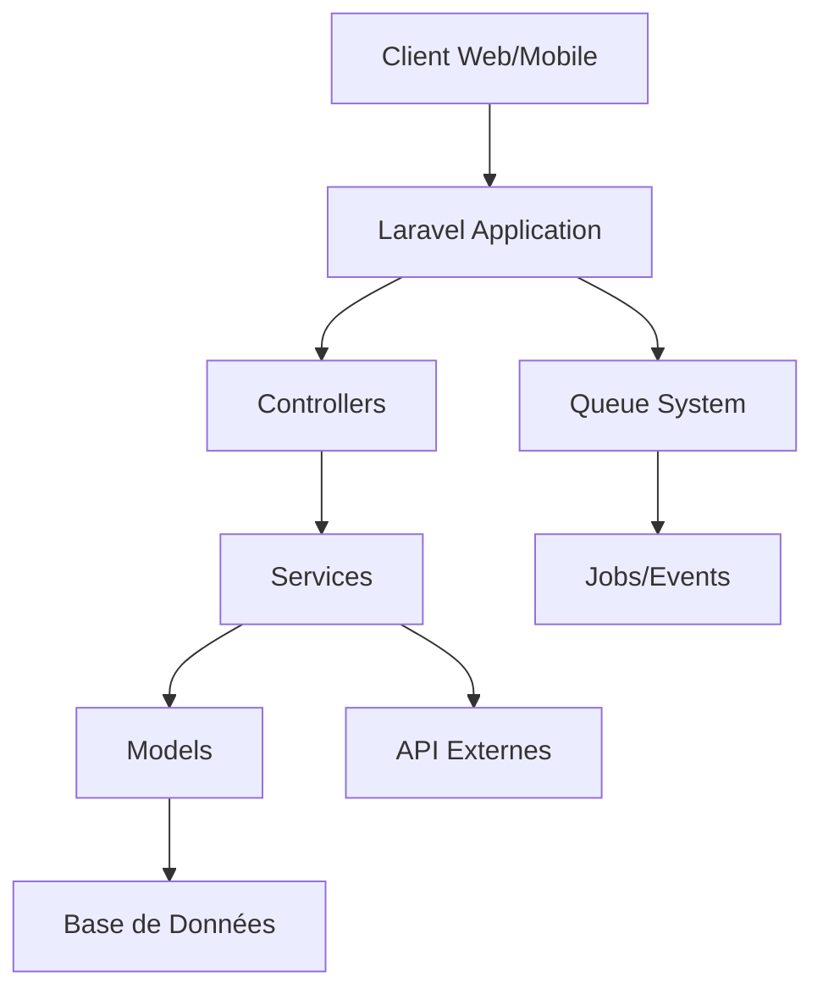

## Vue d'ensemble

ClicknEat est une application web de réservation et commande de repas en ligne développée dans le cadre du BTS SIO option SLAM. Cette plateforme permet aux clients de réserver une table dans un restaurant et de commander leur repas à l'avance, afin que celui-ci soit prêt dès leur arrivée, optimisant ainsi l'expérience client et la gestion des restaurants.

## Contexte professionnel

Ce projet répond à une demande croissante dans le secteur de la restauration pour des solutions numériques permettant d'optimiser la gestion des établissements et d'améliorer l'expérience client. Dans un contexte post-pandémique où la digitalisation des services est devenue essentielle, ClicknEat offre une solution complète pour connecter les restaurants à leur clientèle.

## Compétences mises en œuvre

Ce projet mobilise plusieurs compétences du référentiel BTS SIO SLAM :
- **Développement d'applications** : Conception et développement d'une application web complète
- **Gestion de projet** : Planification, organisation et suivi du développement
- **Base de données** : Conception et manipulation d'une base de données relationnelle
- **Cybersécurité** : Mise en place d'un système d'authentification sécurisé
- **Intégration web** : Développement d'interfaces responsives et ergonomiques

## Objectifs du Projet

- Permettre aux clients de commander des repas en ligne
- Offrir aux restaurants une interface de gestion de leurs commandes
- Fournir un système de paiement sécurisé
- Gérer les réservations de tables
- Optimiser l'expérience utilisateur dans la restauration

## Architecture Technique

### Stack Technologique

- **Backend**: Laravel 10 (PHP 8.2)
- **Frontend**: Blade, JavaScript, CSS, Bootstrap 5
- **Base de données**: MySQL
- **Authentification**: Laravel Breeze
- **Paiement**: Stripe (via Laravel Cashier)
- **Déploiement**: Git, GitHub Actions (CI/CD)

### Composants Principaux

1. **Système d'authentification**
   - Gestion des rôles (Admin, Restaurateur, Client)
   - Authentification sécurisée
   - Vérification d'email

2. **Gestion des restaurants**
   - CRUD des restaurants
   - Gestion des menus et plats
   - Configuration des horaires et disponibilités

3. **Système de commande**
   - Panier d'achat
   - Processus de checkout
   - Intégration Stripe

4. **Gestion des utilisateurs**
   - Profils utilisateurs
   - Historique des commandes
   - Préférences et adresses

## Fonctionnalités Principales

### Pour les Clients
- Création de compte et authentification
- Recherche de restaurants
- Commande de plats
- Paiement sécurisé
- Suivi des commandes

### Pour les Restaurateurs
- Gestion du menu
- Suivi des commandes
- Configuration du restaurant
- Statistiques de vente

### Pour les Administrateurs
- Gestion globale des utilisateurs
- Supervision des restaurants
- Rapports et statistiques
- Configuration système

## Structure du Projet

```
UberEat/
|-- app/
|   |-- Http/
|   |   |-- Controllers/
|   |   |   |-- Admin/
|   |   |   |-- Auth/
|   |   |   `-- Client/
|   |-- Models/
|   `-- Services/
|-- resources/
|   `-- views/
|-- routes/
|   `-- web.php
`-- config/
```

## Sécurité

- Protection CSRF
- Validation des données
- Authentification sécurisée
- Gestion des permissions
- Sécurisation des paiements

## Maintenance et Support

Le projet est maintenu activement avec :
- Mises à jour de sécurité régulières
- Corrections de bugs
- Améliorations continues
- Support technique disponible

---

# Guide d'Installation

## Prérequis

- PHP >= 8.2
- Composer >= 2.0
- MySQL >= 8.0
- Node.js >= 16.0
- Git

## Configuration Système Recommandée

- Mémoire RAM : 4GB minimum
- Espace disque : 2GB minimum
- Système d'exploitation : Linux, macOS, ou Windows avec WSL2

## Installation Pas à Pas

### 1. Cloner le Projet

```bash
git clone https://github.com/votre-organisation/UberEat.git
cd UberEat
```

### 2. Installation des Dépendances PHP

```bash
composer install
```

### 3. Installation des Dépendances Frontend

```bash
npm install
npm run build
```

### 4. Configuration de l'Environnement

```bash
# Copier le fichier d'environnement
cp .env.example .env

# Générer la clé d'application
php artisan key:generate
```

### 5. Configuration de la Base de Données

Modifier le fichier `.env` avec vos paramètres de base de données :

```env
DB_CONNECTION=mysql
DB_HOST=127.0.0.1
DB_PORT=3306
DB_DATABASE=ClicknEat
DB_USERNAME=votre_utilisateur
DB_PASSWORD=votre_mot_de_passe
```

### 6. Migration et Seeding

```bash
# Créer les tables
php artisan migrate

# Charger les données de test (optionnel)
php artisan db:seed
```

### 7. Configuration de Stripe

Ajouter vos clés Stripe dans le fichier `.env` :

```env
STRIPE_KEY=votre_cle_publique
STRIPE_SECRET=votre_cle_secrete
```

### 8. Configuration du Serveur Mail

```env
MAIL_MAILER=smtp
MAIL_HOST=smtp.mailtrap.io
MAIL_PORT=2525
MAIL_USERNAME=votre_username
MAIL_PASSWORD=votre_password
MAIL_ENCRYPTION=tls
```

### 9. Storage Link

```bash
php artisan storage:link
```

### 10. Démarrage du Serveur

```bash
# Démarrer le serveur de développement
php artisan serve

# Dans un autre terminal, lancer le compilateur d'assets
npm run dev
```

## Vérification de l'Installation

1. Accédez à `http://localhost:8000`
2. Vérifiez que la page d'accueil s'affiche correctement
3. Testez la création d'un compte
4. Vérifiez la connexion à la base de données

## Configuration Supplémentaire

### Cache et Optimisation

```bash
# Optimiser l'application
php artisan optimize

# Mettre en cache la configuration
php artisan config:cache

# Mettre en cache les routes
php artisan route:cache
```

### Configuration du Cron (Production)

Ajouter au crontab :

```bash
* * * * * cd /chemin/vers/projet && php artisan schedule:run >> /dev/null 2>&1
```

## Résolution des Problèmes Courants

### Erreur de Permissions

```bash
# Ajuster les permissions des dossiers
chmod -R 775 storage bootstrap/cache
chown -R www-data:www-data storage bootstrap/cache
```

### Erreur de Composer

```bash
# Nettoyer le cache de Composer
composer clear-cache

# Mettre à jour les autoloads
composer dump-autoload
```

## Support

En cas de problème lors de l'installation, veuillez :

1. Consulter les logs dans `storage/logs/laravel.log`
2. Vérifier la documentation Laravel officielle
3. Contacter l'équipe de support technique

## Environnements de Développement Recommandés

- VS Code avec les extensions PHP
- PHPStorm
- Docker (optionnel) 

---

# Architecture du Projet

## Vue d'Ensemble



## Structure des Couches

### 1. Couche Présentation

```
resources/
|-- views/
|   |-- layouts/         # Templates de base
|   |-- components/      # Composants Blade réutilisables
|   |-- admin/          # Vues administration
|   |-- restaurant/     # Vues gestion restaurant
|   `-- client/         # Vues client
|-- js/
`-- css/
```

### 2. Couche Application

```
app/
|-- Http/
|   |-- Controllers/
|   |   |-- Admin/          # Logique administration
|   |   |-- Restaurant/     # Logique restaurant
|   |   `-- Client/         # Logique client
|   |-- Middleware/         # Filtres de requêtes
|   `-- Requests/          # Validation des formulaires
|-- Services/
|   |-- Payment/           # Service de paiement
|   |-- Order/            # Service de commande
|   `-- Notification/     # Service de notification
`-- Events/               # Événements système
```

### 3. Couche Domaine

```
app/
|-- Models/
|   |-- User.php
|   |-- Restaurant.php
|   |-- Menu.php
|   |-- Order.php
|   `-- Product.php
|-- Repositories/
|   |-- UserRepository.php
|   `-- OrderRepository.php
`-- Interfaces/
    `-- RepositoryInterfaces/
```

## Flux de Données

### 1. Processus de Commande

```ascii
Client        Frontend      OrderController    OrderService    PaymentService    NotificationService
  |              |               |                 |                |                    |
  |---commande-->|               |                 |                |                    |
  |              |--soumission-->|                 |                |                    |
  |              |               |---traitement--->|                |                    |
  |              |               |                 |---paiement---->|                    |
  |              |               |                 |<--confirmation-|                    |
  |              |               |                 |---notification----------------->|    |
  |              |               |                 |<--confirmation-----------------|    |
  |              |               |<----statut------|                |                    |
  |              |<---réponse----|                 |                |                    |
  |<-confirmation|               |                 |                |                    |
  |              |               |                 |                |                    |
```

## Composants Clés

### 1. Système d'Authentification

- Utilisation de Laravel Breeze
- Middleware personnalisé pour les rôles
- Sessions sécurisées

### 2. Gestion des Commandes

- Pattern Repository
- Queue system pour les tâches asynchrones
- Transactions DB pour l'intégrité des données

### 3. Système de Paiement

- Intégration Stripe via Laravel Cashier
- Gestion sécurisée des transactions
- Webhooks pour les notifications

## Patterns de Conception Utilisés

### 1. Repository Pattern
```php
interface OrderRepositoryInterface {
    public function create(array $data);
    public function find($id);
    public function update($id, array $data);
}
```

### 2. Service Pattern
```php
class OrderService {
    private $orderRepository;
    private $paymentService;
    
    public function __construct(
        OrderRepositoryInterface $orderRepository,
        PaymentService $paymentService
    ) {
        $this->orderRepository = $orderRepository;
        $this->paymentService = $paymentService;
    }
}
```

### 3. Observer Pattern
```php
class OrderCreatedEvent {
    public $order;
    
    public function __construct(Order $order) {
        $this->order = $order;
    }
}
```

## Sécurité

### 1. Middleware de Sécurité
- Authentication
- CSRF Protection
- Rate Limiting
- XSS Protection

### 2. Validation
- Form Requests
- Sanitization des entrées
- Validation personnalisée

## Cache et Performance

### 1. Stratégie de Cache
- Cache de routes
- Cache de configuration
- Cache de vues
- Redis pour les sessions

### 2. Optimisation
- Eager Loading
- Index DB
- Query optimization

## Monitoring et Logging

### 1. Système de Logs
- Logs d'erreurs
- Logs de transactions
- Logs de sécurité

### 2. Monitoring
- Performance monitoring
- Error tracking
- User activity tracking 

---

# Routes de l'Application

## Routes Web Publiques

### Page d'Accueil et Authentification
| Méthode | URI | Action | Description |
|---------|-----|--------|-------------|
| GET | / | HomeController@index | Page d'accueil |
| GET | /login | Auth/LoginController@showLoginForm | Formulaire de connexion |
| POST | /login | Auth/LoginController@login | Traitement de la connexion |
| POST | /logout | Auth/LoginController@logout | Déconnexion |
| GET | /register | Auth/RegisterController@showRegistrationForm | Formulaire d'inscription |
| POST | /register | Auth/RegisterController@register | Traitement de l'inscription |

### Restaurants et Menus
| Méthode | URI | Action | Description |
|---------|-----|--------|-------------|
| GET | /restaurants | RestaurantController@index | Liste des restaurants |
| GET | /restaurants/{id} | RestaurantController@show | Détails d'un restaurant |
| GET | /restaurants/{id}/menu | MenuController@show | Menu d'un restaurant |

## Routes Client Authentifiées

### Gestion du Panier
| Méthode | URI | Action | Description |
|---------|-----|--------|-------------|
| GET | /cart | CartController@index | Afficher le panier |
| POST | /cart/add | CartController@add | Ajouter au panier |
| PUT | /cart/update | CartController@update | Modifier le panier |
| DELETE | /cart/remove | CartController@remove | Retirer du panier |

### Commandes
| Méthode | URI | Action | Description |
|---------|-----|--------|-------------|
| GET | /orders | OrderController@index | Liste des commandes |
| POST | /orders | OrderController@store | Créer une commande |
| GET | /orders/{id} | OrderController@show | Détails d'une commande |
| GET | /orders/{id}/track | OrderController@track | Suivi de commande |

### Profil Client
| Méthode | URI | Action | Description |
|---------|-----|--------|-------------|
| GET | /profile | ProfileController@show | Voir le profil |
| PUT | /profile | ProfileController@update | Modifier le profil |
| GET | /addresses | AddressController@index | Gérer les adresses |
| POST | /addresses | AddressController@store | Ajouter une adresse |

## Routes Restaurateur

### Gestion du Restaurant
| Méthode | URI | Action | Description |
|---------|-----|--------|-------------|
| GET | /restaurant/dashboard | Restaurant\DashboardController@index | Tableau de bord |
| PUT | /restaurant/profile | Restaurant\ProfileController@update | Modifier profil restaurant |
| GET | /restaurant/orders | Restaurant\OrderController@index | Gérer les commandes |
| PUT | /restaurant/orders/{id} | Restaurant\OrderController@update | Mettre à jour statut commande |

### Gestion des Menus
| Méthode | URI | Action | Description |
|---------|-----|--------|-------------|
| GET | /restaurant/menu | Restaurant\MenuController@index | Gérer le menu |
| POST | /restaurant/menu/items | Restaurant\MenuController@store | Ajouter un plat |
| PUT | /restaurant/menu/items/{id} | Restaurant\MenuController@update | Modifier un plat |
| DELETE | /restaurant/menu/items/{id} | Restaurant\MenuController@destroy | Supprimer un plat |

## Routes Administrateur

### Gestion des Utilisateurs
| Méthode | URI | Action | Description |
|---------|-----|--------|-------------|
| GET | /admin/users | Admin\UserController@index | Liste des utilisateurs |
| GET | /admin/users/{id} | Admin\UserController@show | Détails utilisateur |
| PUT | /admin/users/{id} | Admin\UserController@update | Modifier utilisateur |
| DELETE | /admin/users/{id} | Admin\UserController@destroy | Supprimer utilisateur |

### Gestion des Restaurants
| Méthode | URI | Action | Description |
|---------|-----|--------|-------------|
| GET | /admin/restaurants | Admin\RestaurantController@index | Liste des restaurants |
| POST | /admin/restaurants | Admin\RestaurantController@store | Créer restaurant |
| PUT | /admin/restaurants/{id} | Admin\RestaurantController@update | Modifier restaurant |
| DELETE | /admin/restaurants/{id} | Admin\RestaurantController@destroy | Supprimer restaurant |

## Routes API

### API Publique
| Méthode | URI | Action | Description |
|---------|-----|--------|-------------|
| GET | /api/restaurants | Api\RestaurantController@index | Liste restaurants |
| GET | /api/restaurants/{id} | Api\RestaurantController@show | Détails restaurant |
| GET | /api/menu/{id} | Api\MenuController@show | Menu restaurant |

### API Authentifiée
| Méthode | URI | Action | Description |
|---------|-----|--------|-------------|
| POST | /api/orders | Api\OrderController@store | Créer commande |
| GET | /api/orders/{id} | Api\OrderController@show | Détails commande |
| GET | /api/user/orders | Api\UserController@orders | Commandes utilisateur |

## Middleware Appliqués

### Routes Publiques
```php
Route::middleware(['web'])->group(function () {
    // Routes publiques
});
```

### Routes Authentifiées
```php
Route::middleware(['web', 'auth'])->group(function () {
    // Routes authentifiées
});
```

### Routes Restaurateur
```php
Route::middleware(['web', 'auth', 'restaurant'])->group(function () {
    // Routes restaurateur
});
```

### Routes Admin
```php
Route::middleware(['web', 'auth', 'admin'])->group(function () {
    // Routes admin
});
```

## Notes sur la Sécurité

- Toutes les routes POST/PUT/DELETE sont protégées par CSRF
- Rate limiting appliqué sur les routes d'API
- Validation des permissions via middleware
- Sanitization des entrées utilisateur 

---

# Diagrammes

## Vue d'ensemble des diagrammes

Cette section présente les différents diagrammes techniques qui illustrent l'architecture et le fonctionnement de l'application ClicknEat. Ces diagrammes sont essentiels pour comprendre les différents aspects du système, de sa conception à son déploiement.

---

### Diagramme d'activité

Le diagramme d'activité détaille le flux complet des processus métier de l'application, notamment :
- Le parcours client de la connexion à la commande
- Le traitement des commandes côté restaurant
- Les processus de validation et de paiement
- Les étapes de préparation et de service

Ce diagramme est particulièrement utile pour les nouveaux développeurs et les parties prenantes business pour comprendre le flux global de l'application.

---

### Diagramme de base de données

Le diagramme de base de données présente la structure complète du stockage des données :
- Relations entre les différentes tables
- Clés primaires et étrangères
- Types de données et contraintes
- Indexes et optimisations

Ce schéma est crucial pour les développeurs travaillant sur les requêtes et la structure des données.

---

### Diagramme de classes

Le diagramme de classes illustre l'architecture orientée objet du système :
- Hiérarchie des classes
- Relations entre les objets
- Méthodes et attributs principaux
- Patterns de conception utilisés

Ce diagramme est essentiel pour comprendre l'organisation du code et maintenir sa cohérence.

---

### Diagramme de communication

Le diagramme de communication montre comment les différents composants interagissent :
- Flux de messages entre les services
- Protocoles de communication utilisés
- Points d'intégration avec les systèmes externes
- Gestion des événements système

Particulièrement utile pour comprendre les aspects d'intégration et de messagerie.

---

### Diagramme de composants

Le diagramme de composants détaille l'architecture modulaire :
- Services principaux et leurs responsabilités
- Dépendances entre les composants
- Interfaces publiques
- Composants tiers intégrés

Essential pour comprendre la structure modulaire de l'application.

---

### Diagramme de contexte

Le diagramme de contexte situe l'application dans son environnement global :
- Interactions avec les systèmes externes
- Flux de données entrants et sortants
- Acteurs principaux du système
- Limites du système

Permet une vue d'ensemble rapide du périmètre de l'application.

---

### Diagramme de couches
    
Le diagramme de couches présente l'architecture en couches :
- Séparation des responsabilités
- Flux de données entre les couches
- Règles de dépendance
- Organisation du code

Crucial pour maintenir une architecture propre et maintenable.

---

### Diagramme de déploiement

Le diagramme de déploiement illustre l'infrastructure technique :
- Serveurs et environnements
- Configuration réseau
- Services cloud utilisés
- Stratégie de scalabilité

Essentiel pour les équipes DevOps et les administrateurs système.

---

### Diagramme de gestion des erreurs

Le diagramme de gestion des erreurs montre :
- Stratégies de gestion des exceptions
- Logging et monitoring des erreurs
- Processus de récupération
- Notifications et alertes

Important pour assurer la robustesse et la fiabilité du système.

---

### Diagramme d'état

Le diagramme d'état détaille les différents états possibles :
- États des commandes
- Transitions possibles
- Conditions de changement d'état
- Actions déclenchées

Crucial pour la gestion du cycle de vie des commandes.

---

### Diagramme de flux

Le diagramme de flux représente la circulation des données :
- Flux de données entre les modules
- Transformations des données
- Points de validation
- Stockage et cache

Essentiel pour comprendre le traitement des données dans l'application.

---

### Diagramme de monitoring

Le diagramme de monitoring présente :
- Points de surveillance système
- Métriques collectées
- Systèmes d'alerte
- Tableaux de bord

Important pour le suivi et la maintenance de l'application en production.

---

### Diagramme de paiement

Le diagramme de paiement détaille :
- Intégration avec Stripe
- Sécurisation des transactions
- Gestion des remboursements
- Réconciliation comptable

Crucial pour la gestion sécurisée des paiements.

---

### Diagramme de sécurité

Le diagramme de sécurité illustre :
- Mécanismes d'authentification
- Gestion des autorisations
- Protection des données
- Audit de sécurité

Essentiel pour maintenir la sécurité du système.

---

### Diagramme de séquence

Le diagramme de séquence montre :
- Interactions chronologiques entre composants
- Échange de messages
- Synchronisation des processus
- Gestion des timeouts

Important pour comprendre le comportement temporel du système.

---
